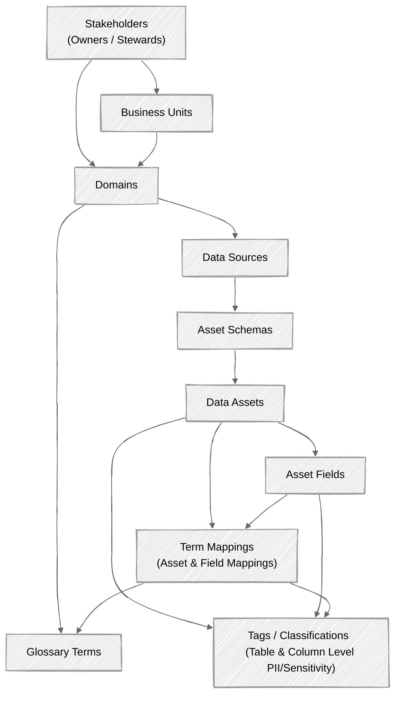

# Enterprise Metadata & Data Governance Relational SQL Schema

I have designed and generated a comprehensive, enterprise-grade relational SQL schema (PostgreSQL-compatible) that fully satisfies your requirements. It captures **Domains**, **Business Units**, **Glossary definitions**, **Technical & Business Owners**, **Data Sources**, **Schemas**, **Tables**, **Fields (with data types, length, PK/FK relationships)**, **Tags & Classifications (at both table and field/column levels)**, and **Data Quality monitoring**.

The complete SQL script has been saved to your workspace as `/home/ubuntu/metadata_governance_schema.sql` and is attached to this message.

---

## Architecture and Entity-Relationship Overview

The schema is structured into 8 modular, normalized tables with foreign key constraints enforcing referential integrity:

```
[Stakeholders] (Owners / Stewards)
      │
      ├──────────────────────┐
      ▼                      ▼
[Business Units] ──> [Domains] ──> [Data Sources] ──> [Asset Schemas] ──> [Data Assets] ──> [Asset Fields]
                                          │                                   │                 │
                                          │                                   ▼                 ▼
                                    [Glossary Terms] ◄─────────────── [Term Mappings]   [Field Mappings]
                                          │                                   │                 │
                                          └───────────────────────────────────┴─────────────────┘
                                                                              │
                                                                              ▼
                                                                     [Tags / Classifications]
                                                                     (Table & Column Level PII/Sensitivity)
```



---

## Detailed Table Breakdown

### 1. Stakeholders (`stakeholders`)
Stores individuals who act as technical owners, business stewards, domain leads, or data producers.
* **Fields**: `stakeholder_id` (PK), `email`, `full_name`, `title`, `slack_handle`.

### 2. Business Units & Domains (`business_units`, `domains`)
Implements organizational structures and Data Mesh bounded contexts.
* **`business_units`**: High-level organizational divisions (e.g., *Finance*, *Risk*, *Commercial*).
* **`domains`**: Sub-domains assigned to a business unit and led by a designated stakeholder (`domain_lead_id`).

### 3. Tags & Classifications (`tag_categories`, `tags`)
A flexible taxonomy engine for classifying data assets and columns.
* **`tag_categories`**: Groupings like *Sensitivity*, *Compliance*, or *Data Tier* (Gold/Silver/Bronze).
* **`tags`**: Specific labels such as `PII`, `Confidential`, `GDPR`, `PCI-DSS`.

### 4. Business Glossary (`glossary_terms`)
Authoritative enterprise definitions, formulas, and business rules linked to a domain and steward.

### 5. Data Assets & Relational Hierarchy (`data_sources`, `asset_schemas`, `data_assets`, `asset_fields`)
Captures physical or cloud storage hierarchy down to the column level with explicit foreign keys.
* **`data_sources`**: Databases or lakes (e.g., *Production PostgreSQL*, *Snowflake DW*).
* **`asset_schemas`**: Logical namespaces inside sources (e.g., `public`, `finance_mart`).
* **`data_assets`**: Tables, views, or streams (`row_count`, `bytes_size`).
* **`asset_fields`**: Columns with complete typing metadata:
  * `data_type` (e.g., `VARCHAR(255)`, `TIMESTAMP`, `NUMERIC(18,2)`)
  * `max_length`
  * `is_nullable`, `is_primary_key`, `is_foreign_key`
  * `foreign_key_target_field_id` (Self-referencing foreign key linking column directly to its target primary key column across assets).

### 6. Mapping & Association Tables (Many-to-Many)
* **`asset_term_mappings`**: Links tables/assets to glossary concepts.
* **`field_term_mappings`**: Links specific columns to glossary terms.
* **`asset_tag_mappings`**: Applies tags at the table level.
* **`field_tag_mappings`**: Applies granular column-level tags (e.g., marking `email_address` as `PII`).

### 7. Data Quality & Observability (`data_quality_rules`, `data_quality_executions`)
Enables automated validation assertions (e.g., `NOT NULL`, uniqueness, freshness, value ranges) and logs historical execution results.

---

## SQL Schema Implementation File

```sql

-- ==============================================================================
-- Enterprise Metadata & Data Governance Relational SQL Schema
-- Compatible with PostgreSQL 14+
-- 
-- Description:
-- This schema establishes a robust relational foundation to capture:
-- 1. Users, Owners, and Stakeholders (Technical & Business Owners)
-- 2. Domains and Business Units
-- 3. Business Glossary & Terms (with linked Data Assets and Fields)
-- 4. Tags, Classifications (Sensitivity, Tiering), and Glossary mappings
-- 5. Data Sources, Schemas, Tables/Assets, and Fields (Columns)
-- 6. Data Quality Rules and Execution Results
-- 
-- Key Features:
-- - Uses simple auto-incrementing integers (SERIAL) for primary/foreign keys.
-- - Includes comprehensive table-level and column-level comments.
-- ==============================================================================

BEGIN;

-- ==============================================================================
-- 1. STAKEHOLDERS & OWNERS
-- ==============================================================================

CREATE TABLE stakeholders (
    stakeholder_id SERIAL PRIMARY KEY,
    email VARCHAR(255) UNIQUE NOT NULL,
    full_name VARCHAR(150) NOT NULL,
    title VARCHAR(100),
    slack_handle VARCHAR(50),
    created_at TIMESTAMP WITH TIME ZONE DEFAULT CURRENT_TIMESTAMP,
    updated_at TIMESTAMP WITH TIME ZONE DEFAULT CURRENT_TIMESTAMP
);

COMMENT ON TABLE stakeholders IS 'Central repository of individuals who act as technical owners, business stewards, or data producers.';
COMMENT ON COLUMN stakeholders.stakeholder_id IS 'Unique auto-incrementing identifier for the stakeholder.';
COMMENT ON COLUMN stakeholders.email IS 'Primary corporate email address of the stakeholder.';
COMMENT ON COLUMN stakeholders.full_name IS 'Full name of the stakeholder.';
COMMENT ON COLUMN stakeholders.title IS 'Job title or role description of the stakeholder.';
COMMENT ON COLUMN stakeholders.slack_handle IS 'Internal Slack username or handle for rapid communication.';
COMMENT ON COLUMN stakeholders.created_at IS 'Timestamp when the stakeholder record was created.';
COMMENT ON COLUMN stakeholders.updated_at IS 'Timestamp when the stakeholder record was last updated.';


-- ==============================================================================
-- 2. DOMAINS & BUSINESS UNITS
-- ==============================================================================

CREATE TABLE business_units (
    business_unit_id SERIAL PRIMARY KEY,
    name VARCHAR(100) UNIQUE NOT NULL,
    description TEXT,
    created_at TIMESTAMP WITH TIME ZONE DEFAULT CURRENT_TIMESTAMP
);

COMMENT ON TABLE business_units IS 'High-level organizational divisions (e.g., Finance, Risk, Marketing, Product).';
COMMENT ON COLUMN business_units.business_unit_id IS 'Unique auto-incrementing identifier for the business unit.';
COMMENT ON COLUMN business_units.name IS 'Name of the business unit.';
COMMENT ON COLUMN business_units.description IS 'Detailed description of the business unit scope and responsibilities.';
COMMENT ON COLUMN business_units.created_at IS 'Timestamp when the business unit was recorded.';


CREATE TABLE domains (
    domain_id SERIAL PRIMARY KEY,
    business_unit_id INTEGER REFERENCES business_units(business_unit_id) ON DELETE SET NULL,
    name VARCHAR(100) UNIQUE NOT NULL,
    description TEXT,
    domain_lead_id INTEGER REFERENCES stakeholders(stakeholder_id) ON DELETE SET NULL,
    created_at TIMESTAMP WITH TIME ZONE DEFAULT CURRENT_TIMESTAMP,
    updated_at TIMESTAMP WITH TIME ZONE DEFAULT CURRENT_TIMESTAMP
);

COMMENT ON TABLE domains IS 'Data Mesh domains representing distinct business bounded contexts (e.g., Customer Domain, Revenue Domain).';
COMMENT ON COLUMN domains.domain_id IS 'Unique auto-incrementing identifier for the domain.';
COMMENT ON COLUMN domains.business_unit_id IS 'Foreign key referencing the parent business unit.';
COMMENT ON COLUMN domains.name IS 'Name of the domain.';
COMMENT ON COLUMN domains.description IS 'Detailed description of the data domain boundary.';
COMMENT ON COLUMN domains.domain_lead_id IS 'Foreign key referencing the stakeholder acting as domain lead.';
COMMENT ON COLUMN domains.created_at IS 'Timestamp when the domain was created.';
COMMENT ON COLUMN domains.updated_at IS 'Timestamp when the domain was last updated.';


-- ==============================================================================
-- 3. TAGS & CLASSIFICATIONS
-- ==============================================================================

CREATE TABLE tag_categories (
    category_id SERIAL PRIMARY KEY,
    name VARCHAR(50) UNIQUE NOT NULL,
    description TEXT
);

COMMENT ON TABLE tag_categories IS 'Taxonomy groupings for tags and classifications (e.g., Sensitivity, GDPR, Data Tier).';
COMMENT ON COLUMN tag_categories.category_id IS 'Unique auto-incrementing identifier for the tag category.';
COMMENT ON COLUMN tag_categories.name IS 'Name of the tag category (e.g., Sensitivity, Data Tier).';
COMMENT ON COLUMN tag_categories.description IS 'Description of what this category classifies.';


CREATE TABLE tags (
    tag_id SERIAL PRIMARY KEY,
    category_id INTEGER REFERENCES tag_categories(category_id) ON DELETE CASCADE,
    name VARCHAR(100) UNIQUE NOT NULL,
    description TEXT,
    created_at TIMESTAMP WITH TIME ZONE DEFAULT CURRENT_TIMESTAMP
);

COMMENT ON TABLE tags IS 'Individual tags or classification labels applied to data assets, tables, or fields.';
COMMENT ON COLUMN tags.tag_id IS 'Unique auto-incrementing identifier for the tag.';
COMMENT ON COLUMN tags.category_id IS 'Foreign key referencing the parent tag category.';
COMMENT ON COLUMN tags.name IS 'Name of the tag (e.g., PII, Confidential, Gold-Tier).';
COMMENT ON COLUMN tags.description IS 'Definition and criteria for applying this tag.';
COMMENT ON COLUMN tags.created_at IS 'Timestamp when the tag was created.';


-- ==============================================================================
-- 4. BUSINESS GLOSSARY
-- ==============================================================================

CREATE TABLE glossary_terms (
    term_id SERIAL PRIMARY KEY,
    domain_id INTEGER REFERENCES domains(domain_id) ON DELETE SET NULL,
    term_name VARCHAR(150) UNIQUE NOT NULL,
    definition TEXT NOT NULL,
    business_rules TEXT,
    status VARCHAR(30) DEFAULT 'Draft',
    steward_id INTEGER REFERENCES stakeholders(stakeholder_id) ON DELETE SET NULL,
    created_at TIMESTAMP WITH TIME ZONE DEFAULT CURRENT_TIMESTAMP,
    updated_at TIMESTAMP WITH TIME ZONE DEFAULT CURRENT_TIMESTAMP
);

COMMENT ON TABLE glossary_terms IS 'Enterprise business glossary establishing authoritative definitions for metrics and concepts.';
COMMENT ON COLUMN glossary_terms.term_id IS 'Unique auto-incrementing identifier for the glossary term.';
COMMENT ON COLUMN glossary_terms.domain_id IS 'Foreign key referencing the domain responsible for the term.';
COMMENT ON COLUMN glossary_terms.term_name IS 'Standardized business term name (e.g., Monthly Active User, Net Revenue).';
COMMENT ON COLUMN glossary_terms.definition IS 'Authoritative business definition of the term.';
COMMENT ON COLUMN glossary_terms.business_rules IS 'Calculation logic, constraints, or qualitative rules defining the term.';
COMMENT ON COLUMN glossary_terms.status IS 'Lifecycle status of the term (Draft, Approved, Deprecated).';
COMMENT ON COLUMN glossary_terms.steward_id IS 'Foreign key referencing the business steward responsible for the term.';
COMMENT ON COLUMN glossary_terms.created_at IS 'Timestamp when the term was created.';
COMMENT ON COLUMN glossary_terms.updated_at IS 'Timestamp when the term was last updated.';


-- ==============================================================================
-- 5. DATA SOURCES & ASSET HIERARCHY (Database -> Schema -> Table -> Field)
-- ==============================================================================

CREATE TABLE data_sources (
    source_id SERIAL PRIMARY KEY,
    name VARCHAR(100) UNIQUE NOT NULL,
    source_type VARCHAR(50) NOT NULL,
    connection_uri TEXT,
    domain_id INTEGER REFERENCES domains(domain_id) ON DELETE SET NULL,
    technical_owner_id INTEGER REFERENCES stakeholders(stakeholder_id) ON DELETE SET NULL,
    created_at TIMESTAMP WITH TIME ZONE DEFAULT CURRENT_TIMESTAMP,
    updated_at TIMESTAMP WITH TIME ZONE DEFAULT CURRENT_TIMESTAMP
);

COMMENT ON TABLE data_sources IS 'Physical or cloud data storage systems containing datasets.';
COMMENT ON COLUMN data_sources.source_id IS 'Unique auto-incrementing identifier for the data source.';
COMMENT ON COLUMN data_sources.name IS 'Name of the data source instance (e.g., Production PostgreSQL, Snowflake DW).';
COMMENT ON COLUMN data_sources.source_type IS 'Technology platform type (e.g., PostgreSQL, Snowflake, S3, BigQuery, Kafka).';
COMMENT ON COLUMN data_sources.connection_uri IS 'Connection endpoint or URI (credentials scrubbed).';
COMMENT ON COLUMN data_sources.domain_id IS 'Foreign key referencing the domain owning this source.';
COMMENT ON COLUMN data_sources.technical_owner_id IS 'Foreign key referencing the technical owner responsible for infrastructure.';
COMMENT ON COLUMN data_sources.created_at IS 'Timestamp when the source was registered.';
COMMENT ON COLUMN data_sources.updated_at IS 'Timestamp when the source metadata was last updated.';


CREATE TABLE asset_schemas (
    schema_id SERIAL PRIMARY KEY,
    source_id INTEGER REFERENCES data_sources(source_id) ON DELETE CASCADE,
    name VARCHAR(150) NOT NULL,
    description TEXT,
    created_at TIMESTAMP WITH TIME ZONE DEFAULT CURRENT_TIMESTAMP,
    UNIQUE(source_id, name)
);

COMMENT ON TABLE asset_schemas IS 'Database schema or dataset grouping within a data source.';
COMMENT ON COLUMN asset_schemas.schema_id IS 'Unique auto-incrementing identifier for the schema.';
COMMENT ON COLUMN asset_schemas.source_id IS 'Foreign key referencing the parent data source.';
COMMENT ON COLUMN asset_schemas.name IS 'Name of the schema or namespace (e.g., public, finance_mart, raw_stripe).';
COMMENT ON COLUMN asset_schemas.description IS 'Description of the data contents within this schema.';
COMMENT ON COLUMN asset_schemas.created_at IS 'Timestamp when the schema was recorded.';


CREATE TABLE data_assets (
    asset_id SERIAL PRIMARY KEY,
    schema_id INTEGER REFERENCES asset_schemas(schema_id) ON DELETE CASCADE,
    name VARCHAR(200) NOT NULL,
    asset_type VARCHAR(50) DEFAULT 'Table',
    description TEXT,
    business_owner_id INTEGER REFERENCES stakeholders(stakeholder_id) ON DELETE SET NULL,
    technical_owner_id INTEGER REFERENCES stakeholders(stakeholder_id) ON DELETE SET NULL,
    row_count BIGINT,
    bytes_size BIGINT,
    created_at TIMESTAMP WITH TIME ZONE DEFAULT CURRENT_TIMESTAMP,
    updated_at TIMESTAMP WITH TIME ZONE DEFAULT CURRENT_TIMESTAMP,
    UNIQUE(schema_id, name)
);

COMMENT ON TABLE data_assets IS 'Tables, views, or streams representing discrete data entities.';
COMMENT ON COLUMN data_assets.asset_id IS 'Unique auto-incrementing identifier for the data asset.';
COMMENT ON COLUMN data_assets.schema_id IS 'Foreign key referencing the parent schema.';
COMMENT ON COLUMN data_assets.name IS 'Name of the table, view, or stream (e.g., dim_customer, fct_monthly_revenue).';
COMMENT ON COLUMN data_assets.asset_type IS 'Type of asset (Table, View, Stream, API, File).';
COMMENT ON COLUMN data_assets.description IS 'Business and technical description of the asset.';
COMMENT ON COLUMN data_assets.business_owner_id IS 'Foreign key referencing the business owner responsible for asset data quality/meaning.';
COMMENT ON COLUMN data_assets.technical_owner_id IS 'Foreign key referencing the technical owner responsible for the ETL/pipeline.';
COMMENT ON COLUMN data_assets.row_count IS 'Latest observed total row count.';
COMMENT ON COLUMN data_assets.bytes_size IS 'Latest observed storage size in bytes.';
COMMENT ON COLUMN data_assets.created_at IS 'Timestamp when the asset was registered.';
COMMENT ON COLUMN data_assets.updated_at IS 'Timestamp when the asset metadata was last refreshed.';


CREATE TABLE asset_fields (
    field_id SERIAL PRIMARY KEY,
    asset_id INTEGER REFERENCES data_assets(asset_id) ON DELETE CASCADE,
    name VARCHAR(150) NOT NULL,
    data_type VARCHAR(100) NOT NULL,
    max_length INTEGER,
    is_nullable BOOLEAN DEFAULT TRUE,
    is_primary_key BOOLEAN DEFAULT FALSE,
    is_foreign_key BOOLEAN DEFAULT FALSE,
    foreign_key_target_field_id INTEGER REFERENCES asset_fields(field_id) ON DELETE SET NULL,
    description TEXT,
    created_at TIMESTAMP WITH TIME ZONE DEFAULT CURRENT_TIMESTAMP,
    UNIQUE(asset_id, name)
);

COMMENT ON TABLE asset_fields IS 'Columns/fields within a data asset, including typing, nullability, and relational PK/FK constraints.';
COMMENT ON COLUMN asset_fields.field_id IS 'Unique auto-incrementing identifier for the field/column.';
COMMENT ON COLUMN asset_fields.asset_id IS 'Foreign key referencing the parent data asset (table).';
COMMENT ON COLUMN asset_fields.name IS 'Name of the column or field (e.g., customer_id, email_address).';
COMMENT ON COLUMN asset_fields.data_type IS 'SQL data type of the column (e.g., VARCHAR(255), TIMESTAMP, INTEGER, NUMERIC(18,2)).';
COMMENT ON COLUMN asset_fields.max_length is 'Maximum character or byte length if applicable.';
COMMENT ON COLUMN asset_fields.is_nullable IS 'Flag indicating whether column allows NULL values (TRUE) or is strictly NOT NULL (FALSE).';
COMMENT ON COLUMN asset_fields.is_primary_key IS 'Flag indicating whether this field is part of the asset primary key.';
COMMENT ON COLUMN asset_fields.is_foreign_key IS 'Flag indicating whether this field acts as a foreign key.';
COMMENT ON COLUMN asset_fields.foreign_key_target_field_id IS 'Self-referencing foreign key linking this column directly to its target primary key field.';
COMMENT ON COLUMN asset_fields.description IS 'Column-level documentation explaining the meaning of the data stored.';
COMMENT ON COLUMN asset_fields.created_at IS 'Timestamp when the field metadata was recorded.';


-- ==============================================================================
-- 6. MAPPINGS & ASSOCIATIONS (Many-to-Many Relationships)
-- ==============================================================================

CREATE TABLE asset_term_mappings (
    asset_id INTEGER REFERENCES data_assets(asset_id) ON DELETE CASCADE,
    term_id INTEGER REFERENCES glossary_terms(term_id) ON DELETE CASCADE,
    PRIMARY KEY (asset_id, term_id)
);

COMMENT ON TABLE asset_term_mappings IS 'Associates data assets with business glossary terms they embody.';
COMMENT ON COLUMN asset_term_mappings.asset_id IS 'Foreign key referencing the data asset.';
COMMENT ON COLUMN asset_term_mappings.term_id IS 'Foreign key referencing the glossary term.';


CREATE TABLE field_term_mappings (
    field_id INTEGER REFERENCES asset_fields(field_id) ON DELETE CASCADE,
    term_id INTEGER REFERENCES glossary_terms(term_id) ON DELETE CASCADE,
    PRIMARY KEY (field_id, term_id)
);

COMMENT ON TABLE field_term_mappings IS 'Associates specific columns/fields with glossary terms (e.g., mapping column cust_id to term Customer Identifier).';
COMMENT ON COLUMN field_term_mappings.field_id IS 'Foreign key referencing the asset field/column.';
COMMENT ON COLUMN field_term_mappings.term_id IS 'Foreign key referencing the glossary term.';


CREATE TABLE asset_tag_mappings (
    asset_id INTEGER REFERENCES data_assets(asset_id) ON DELETE CASCADE,
    tag_id INTEGER REFERENCES tags(tag_id) ON DELETE CASCADE,
    PRIMARY KEY (asset_id, tag_id)
);

COMMENT ON TABLE asset_tag_mappings IS 'Applies tags and classifications (e.g., Gold Tier, Certified) to data assets.';
COMMENT ON COLUMN asset_tag_mappings.asset_id IS 'Foreign key referencing the data asset.';
COMMENT ON COLUMN asset_tag_mappings.tag_id IS 'Foreign key referencing the tag.';


CREATE TABLE field_tag_mappings (
    field_id INTEGER REFERENCES asset_fields(field_id) ON DELETE CASCADE,
    tag_id INTEGER REFERENCES tags(tag_id) ON DELETE CASCADE,
    PRIMARY KEY (field_id, tag_id)
);

COMMENT ON TABLE field_tag_mappings IS 'Applies granular classifications (e.g., PII, Confidential, PCI-DSS) at the individual column level.';
COMMENT ON COLUMN field_tag_mappings.field_id IS 'Foreign key referencing the asset field/column.';
COMMENT ON COLUMN field_tag_mappings.tag_id IS 'Foreign key referencing the tag.';


-- ==============================================================================
-- 7. DATA QUALITY & OBSERVABILITY
-- ==============================================================================

CREATE TABLE data_quality_rules (
    rule_id SERIAL PRIMARY KEY,
    asset_id INTEGER REFERENCES data_assets(asset_id) ON DELETE CASCADE,
    field_id INTEGER REFERENCES asset_fields(field_id) ON DELETE SET NULL,
    rule_type VARCHAR(50) NOT NULL,
    rule_expression TEXT NOT NULL,
    severity VARCHAR(20) DEFAULT 'Warning',
    created_at TIMESTAMP WITH TIME ZONE DEFAULT CURRENT_TIMESTAMP
);

COMMENT ON TABLE data_quality_rules IS 'Automated data quality checks and assertions defined for assets or fields.';
COMMENT ON COLUMN data_quality_rules.rule_id IS 'Unique auto-incrementing identifier for the data quality rule.';
COMMENT ON COLUMN data_quality_rules.asset_id IS 'Foreign key referencing the target data asset being validated.';
COMMENT ON COLUMN data_quality_rules.field_id IS 'Optional foreign key referencing a specific column if the rule is column-level.';
COMMENT ON COLUMN data_quality_rules.rule_type IS 'Type of assertion (e.g., NotNull, Unique, Range, Freshness, Expression).';
COMMENT ON COLUMN data_quality_rules.rule_expression IS 'Executable condition or expression (e.g., NULL_COUNT == 0 or VALUE >= 0).';
COMMENT ON COLUMN data_quality_rules.severity IS 'Alert severity level if rule fails (Info, Warning, Critical).';
COMMENT ON COLUMN data_quality_rules.created_at IS 'Timestamp when the rule was created.';


CREATE TABLE data_quality_executions (
    execution_id SERIAL PRIMARY KEY,
    rule_id INTEGER REFERENCES data_quality_rules(rule_id) ON DELETE CASCADE,
    status VARCHAR(30) NOT NULL,
    failed_records_count BIGINT DEFAULT 0,
    total_records_checked BIGINT,
    executed_at TIMESTAMP WITH TIME ZONE DEFAULT CURRENT_TIMESTAMP,
    error_message TEXT
);

COMMENT ON TABLE data_quality_executions IS 'Execution history and logs for data quality rules.';
COMMENT ON COLUMN data_quality_executions.execution_id IS 'Unique auto-incrementing identifier for the execution record.';
COMMENT ON COLUMN data_quality_executions.rule_id IS 'Foreign key referencing the executed data quality rule.';
COMMENT ON COLUMN data_quality_executions.status IS 'Execution outcome status (Passed, Failed, Error).';
COMMENT ON COLUMN data_quality_executions.failed_records_count IS 'Number of records failing the assertion condition.';
COMMENT ON COLUMN data_quality_executions.total_records_checked IS 'Total number of records scanned during execution.';
COMMENT ON COLUMN data_quality_executions.executed_at IS 'Timestamp when the quality check was executed.';
COMMENT ON COLUMN data_quality_executions.error_message IS 'Error details if execution failed due to system exception.';


-- ==============================================================================
-- 8. INDEXES FOR PERFORMANCE
-- ==============================================================================

CREATE INDEX idx_assets_schema ON data_assets(schema_id);
CREATE INDEX idx_fields_asset ON asset_fields(asset_id);
CREATE INDEX idx_glossary_domain ON glossary_terms(domain_id);
CREATE INDEX idx_dq_rules_asset ON data_quality_rules(asset_id);
CREATE INDEX idx_dq_exec_rule ON data_quality_executions(rule_id);

COMMIT;
```
