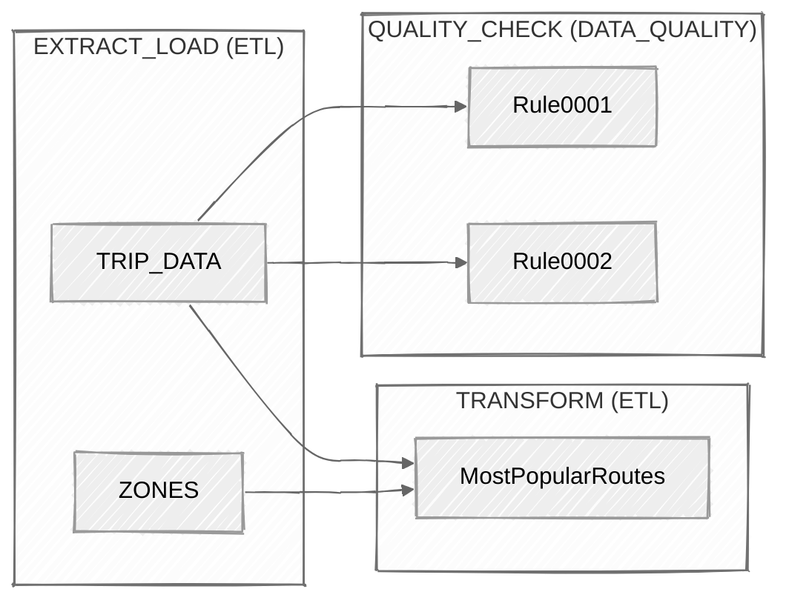
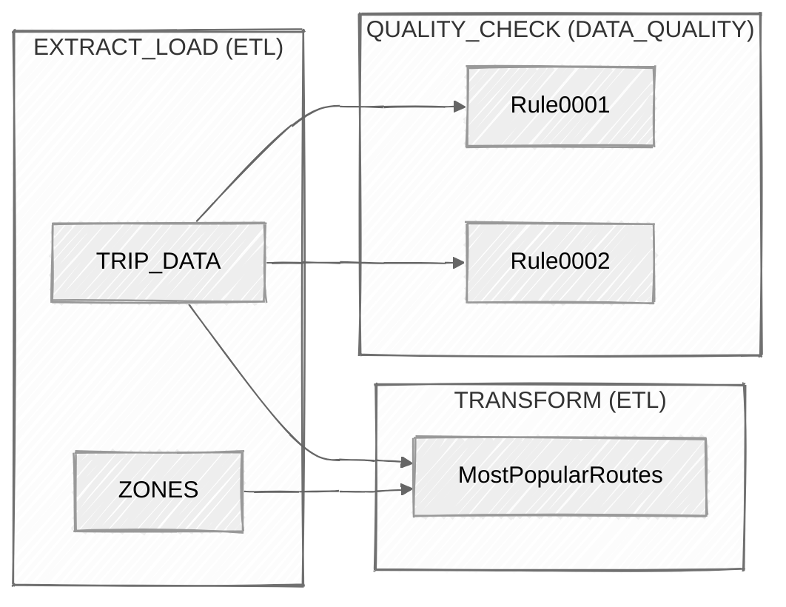

{}

ETLX is not just for executing pipelines — it also enables **automatic workflow visualization**.

Every time an ETLX Markdown model is processed, Central Set:

- parses the structure
- detects dependencies
- generates a graph (nodes + edges)
- renders a **Mermaid workflow diagram**

---

## 🧠 Concept

Each ETLX model is composed of:

- **Level 1** → logical groups (e.g. `EXTRACT_LOAD`, `TRANSFORM`, `QUALITY_CHECK`)
- **Level 2** → actual nodes (e.g. `TRIP_DATA`, `ZONES`, `MostPopularRoutes`)

These are transformed into a **graph structure**:

```

Level 1 → Subgraph
Level 2 → Node
Dependencies → Edges

````

---

# 🔗 Defining Dependencies

## ✅ Explicit Dependencies (`depends_on`)

You can explicitly define dependencies using the `depends_on` key.

```yaml
depends_on:
  - EXTRACT_LOAD.TRIP_DATA
  - EXTRACT_LOAD.ZONES
````

### Rules

* Must be a **list (array)**
* Format:

```
LEVEL1.LEVEL2
```

Example:

```
TRANSFORM.MostPopularRoutes depends_on:
  - EXTRACT_LOAD.TRIP_DATA
  - EXTRACT_LOAD.ZONES
```

This generates edges:

```
TRIP_DATA → MostPopularRoutes
ZONES → MostPopularRoutes
```

---

## 🤖 Inferred Dependencies (Automatic)

If `depends_on` is **not defined**, Central Set will **infer dependencies automatically**.

### How it works

* The system scans queries (SQL, ETLX steps, etc.)
* If a query references a **Level 2 name**, it assumes a dependency

### Example

```sql
SELECT *
FROM TRIP_DATA
```

➡️ Central Set infers:

```
TRANSFORM.X depends_on EXTRACT_LOAD.TRIP_DATA
```

---

## 🧩 Resolution Logic

Dependency resolution follows:

1. **Explicit `depends_on` (highest priority)**
2. **Query-based inference**
3. **No dependency → standalone node**

---

# 🧱 Graph Generation

From the model, Central Set generates:

### Nodes

* Each `LEVEL2` becomes a node
* Grouped by `LEVEL1` into subgraphs

### Edges

* Created from `depends_on` or inferred relationships

---

# 📊 Mermaid Workflow Generation

The graph is converted into a **Mermaid flowchart**.

Example:

````markdown {rownos=table}

````

Resolves to:



---

# 🖼️ Visual Output

The generated Mermaid diagram is rendered as a workflow graph:

* **Subgraphs** → represent ETL stages
* **Nodes** → represent datasets or rules
* **Edges** → represent dependencies

This allows you to instantly understand:

* data flow
* transformation steps
* validation rules
* pipeline structure

---

# 🔄 Real Example Breakdown

From the SQLite example:

### Extract Layer

* `TRIP_DATA`
* `ZONES`

### Transform Layer

* `MostPopularRoutes`

### Data Quality

* `Rule0001`
* `Rule0002`

### Relationships

```
TRIP_DATA → MostPopularRoutes
ZONES → MostPopularRoutes
TRIP_DATA → Rule0001
TRIP_DATA → Rule0002
```

---

# 🚀 Why This Matters

This approach provides:

### ✅ Instant Visualization

No need to manually draw diagrams.

### ✅ Always Up-to-Date

The diagram is generated directly from the model.

### ✅ Debugging Power

Quickly identify:

* missing dependencies
* circular flows
* unused nodes

### ✅ Documentation for Free

Your ETLX model becomes:

* execution logic
* documentation
* architecture diagram

---

# 🧠 Best Practices

### Use explicit `depends_on` when:

* pipelines are complex
* dependencies are not obvious from queries
* you want full control

### Rely on inference when:

* queries are simple
* naming is consistent
* rapid prototyping

### Naming Tip

Keep names consistent:

```
TRIP_DATA
ZONES
CUSTOMERS
```

This improves **dependency detection accuracy**.

---

# 🔮 Future Possibilities

This graph structure can also power:

* pipeline execution planners
* dependency validation
* impact analysis
* lineage tracking
* visual editors

---

# 🚀 Summary

Central Set automatically transforms ETLX models into **visual workflows** by:

* parsing model structure
* detecting dependencies (`depends_on` or inferred)
* generating nodes and edges
* rendering Mermaid diagrams

This makes ETLX:

* self-documenting
* visual by default
* easier to debug
* easier to understand

---

ETLX is not just a pipeline definition — it is a **living, visual data workflow system**.

